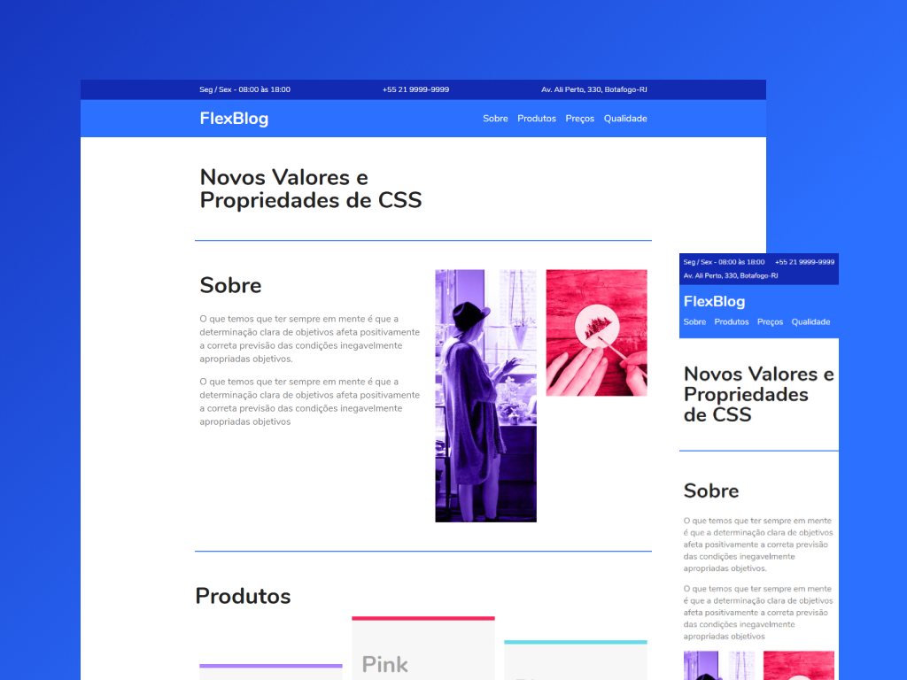

# FlexBlog

Esse é um estudo de caso para colocar em prática os conceitos de posicionamento de elementos utilizando CSS e propriedades do Flexbox, ensinado pelo professor André Rafael da [Origamid](https://www.origamid.com/). O principal objetivo foi desenvolver um layout responsivo.  
 
  
 
[Visualizar projeto ao vivo](https://ferlimatos.github.io/flexblog)
  

# 🕹 Tecnologias

Neste projeto foram utilizadas as seguintes tecnologias:

